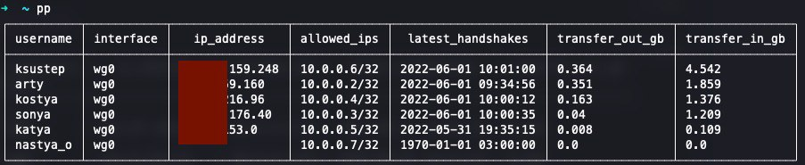

# Wireguard lite monitoring


## sqlite3.37 on Ubuntu
```shell
cd ~ ;\
wget https://github.com/nalgeon/sqlite/releases/download/3.38.0/sqlite3-ubuntu ;\
mv sqlite3-ubuntu sqlite3 ;\
chmod +x sqlite3
```

## Run
```shell
python main.py --users_path /path/to/clients/keys
```

## Check stats
```shell
~/sqlite3 $HOME/db/wg-stats.db -box
```

## Check stats hotkey
```shell
vim $HOME/check.sh

$HOME/code/wg-stats/env/bin/python $HOME/code/wg-stats/main.py --users_path /root/clients/ > /dev/null ;\
$HOME/sqlite3 -box $HOME/db/wg-stats.db -box "select * from v_stats;" ".q"

chmod +x check.sh
vim .zshrc
alias pp="$HOME/check.sh"

source .zshrc
# RUN
pp
```


